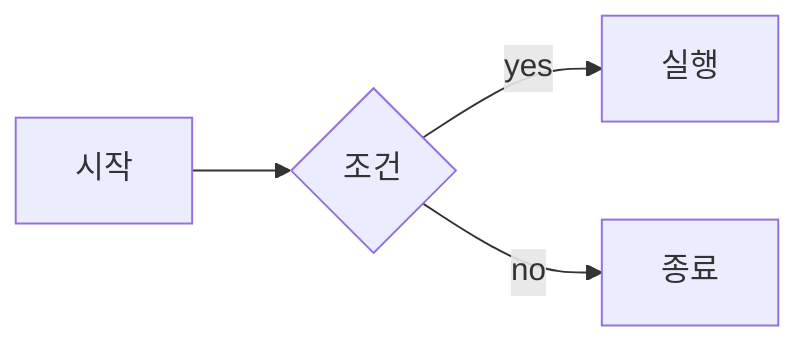
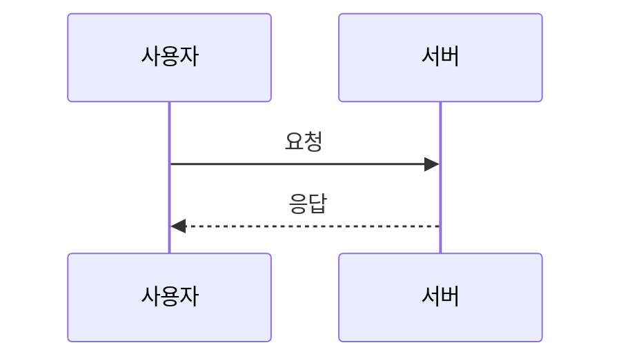

# Mermaid 테스트

일반 마크다운도 잘 렌더되는지 확인.

## 다이어그램

```mermaid
flowchart LR
  A[시작] --> B{조건}
  B -->|yes| C[실행]
  B -->|no| D[종료]
```

## 시퀀스

```mermaid
sequenceDiagram
  사용자->>서버: 요청
  서버-->>사용자: 응답
```
